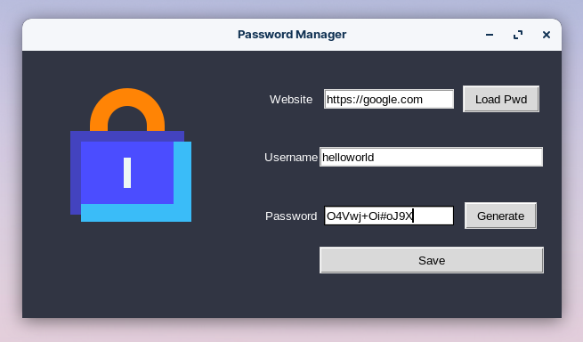

# RSA Password Manager

A desktop application for locally managing passwords using RSA encryption.

Keys in the `rsa_keys` folder are for demonstration purposes only. Please delete them before using the application and a new pair of keys will be generated automatically.

This is a very crude implementation of a password manager. It is not meant to be secure, but it is a good starting point for learning how to use RSA encryption.
